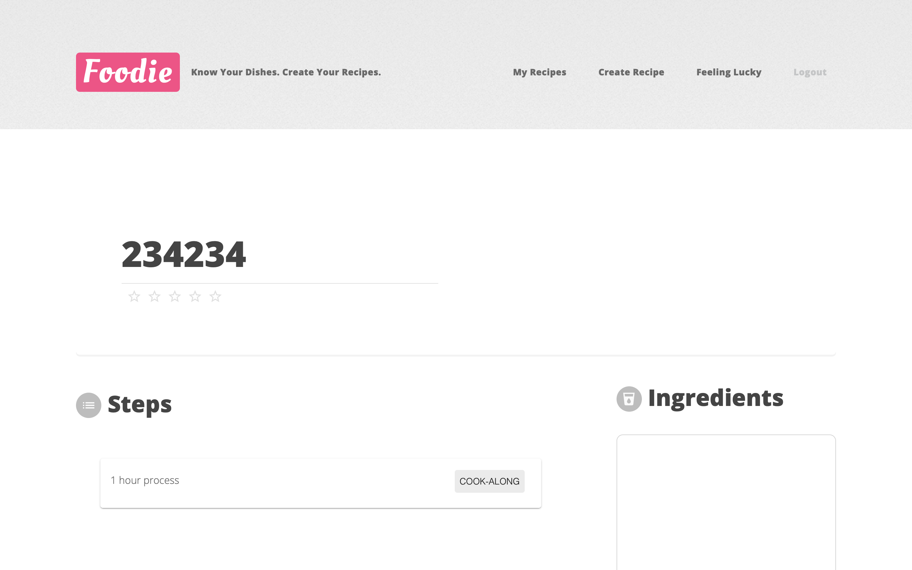
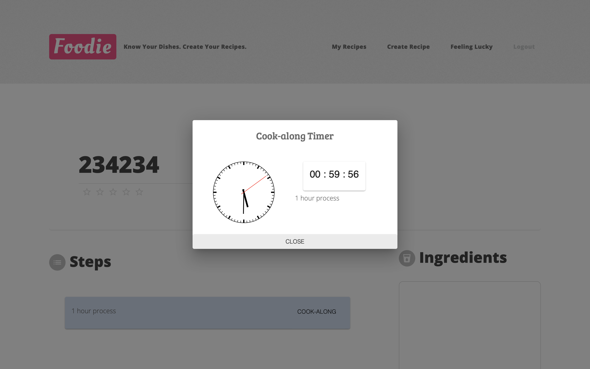

# Foodie 

😋 A simple web-based application that allows users to login, create / edit recipes, scrape online recipes, save / rate recipes, and do real-time cookalongs.

> ❗️ Please use this app in ***Full Screen*** mode for better user experience.

## Requirements Fulfilled
- Used React for frontend development
- Used node.js for backend development
- Used async, await functions for asynchronous tasks (web scraping)
- Used MongoDb for database management

## Run locally
On the terminal (in the *midterm_foodie* folder):
```
npm install
npm run build
npm start
```
## How to use this application
> Take a glimpse of this application.

### Login

Simple login page with username and password field.


Click on the icon for a pop out text explanation.


### Home Page


Take a look at the navigation bar, now you can:

1. Create your own recipe
2. Take a look at your saved recipes
3. Get a random recipe ( *feeling lucky* )


The bottom column is three random recipes recommended for the user (the content is scraped online). You can get the original source by clicking on the logo.

### Create Your Recipe


There are several fields the for user input:

1. Recipe Name: enter name of the recipe
2. Upload Image: upload image for the recipe and preview.
3. Recipe steps: add, delete, drag and drop steps for the recipe.
4. Cooking time for each step: optional input field for cooking / prepare time.
5. Ingredients / Quantity: add or delete ingredients and quantity.

#### Upload an image


#### Click on image path to preview image


#### Add ingredients


#### Add steps


#### Drag and drop steps


### Lookup Saved Recipes

You can view your previously saved recipes for cookalongs.


### Cookalong Page
Your saved recipes may contain cookalongs. 


Your can press the *cook along* button for a pop-out timer.



### Get a Random Recipe

When you click *feeling lucky*, the application will scrape random recipes from the web and show it in the app.
   
You can also rate the recipe.


Press *save recipe* to save the recipe to the database.


## Project Development 

## Frontend

I used the components library **material-ui** and **React** for frontend development. Some other packages include:
1. **react-beautiful-dnd**
2. **react-clock**
3. **react-router**
  
For animations, I used the powerful **animate.css** library.

## Backend 

- For database management, I used **mongoose** which is a client library for **MongoDb**
    - There are two tables in the database: one for saving recipes, and one for username-password lookup.
- For web-scraping, I used **cheerio.js** with **request-promise**.
- User authentication 
    - The password entered is first hashed in the client-side using *sha-256* in the **sjcl.js** crypto library developed by Stannford University. The hash string is stored in the database for username-password pair lookup.

## Frontend-Backend Interaction

The frontend uses the **fetch** method to send requests to the server (*server.js*), and the server uses **express** to handle client requests.

## Wrapping it all up
Used **webpack** to bundle files and **babel** to transpile files. 

## My Contributions
- Hand crafted all server-side code.
    - Request / Responses
    - Image uploading
    - Web scraping
- Developed frontend with pure html/css and component libraries.
- Used MongoDB to store persistent data.
- Linked frontend-backend with **express** and **fetch**.
- Wrote a simple login system (not sure if it is safe though...).

## My Thoughts on in this Project
With no previous web-development experience, this is the first time I started a web-development project from scratch. I felt most satisfied when I finished the server side implementation since I had absolutely no idea what a "server" really is prior to enrolling in this course, but now I am comfortable with handling requests and responses. I also think that this project also provided great training in the field of software engineering since it involved massive amount of self-study, searching for documentations, and reading legacy code - each of which I feel is essential for a succesful software developer.