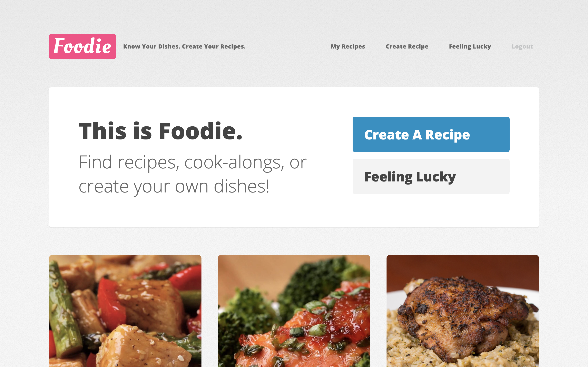
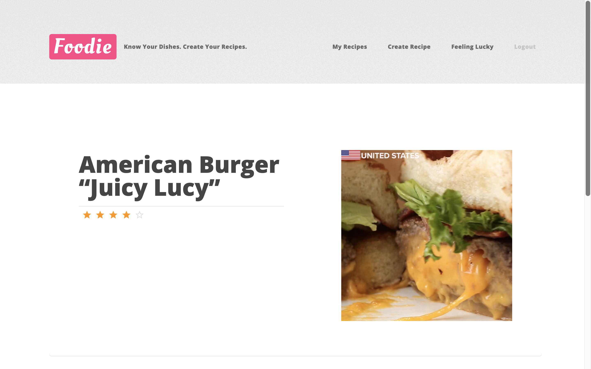

# Foodie 

😋 A simple web-based application that allows users to login, create / edit recipes, scrape online recipes, save / rate recipes, and do real-time cookalongs.

> ❗️ Please use this app in ***Full Screen*** mode for better user experience.

## Requirements Fulfilled
- Used React for frontend development
- Used node.js for backend development
- Used async, await functions for asynchronous tasks (web scraping)
- Used MongoDb for database management

## How to use this application
> Take a glimpse of this application.

### Login

Simple login page according to username.

Click on the icon for a pop out explanation.

### Home Page

Take a look at the navigation bar, now you can:

1. Create your own recipe
2. Take a look at your saved recipes
3. Get a random recipe ( *feeling lucky* )

The bottom column is three random recipes recommended for the user (the content is scraped online).

### Create Your Recipe

There are several fields the for user input:

1. Recipe Name: enter name of the recipe
2. Upload Image: upload image for the recipe and preview.
3. Recipe steps: add, delete, drag and drop steps for the recipe.
4. Ingredients / Quantity: add or delete ingredients and quantity.

#### Upload an image

#### Click on image path to preview image

#### Add ingredients

#### Add steps

#### Drag and drop steps

### Lookup Saved Recipes

You can view your previously saved recipes.

### Get a Random Recipe

When you click *feeling lucky*, the application will scrape random recipes from the web and show it in the app.
   
You can also rate the recipe.

Press *save recipe* to save the recipe to the database.

## Project Development

## Frontend

I used the components library **material-ui** and **React** for frontend development. Some other packages include:
1. **react-beautiful-dnd**
2. **react-clock**

For animations, I used **animate.css**.

## Backend 

- For database management, I used **mongoose** which is a client library for **MongoDb**
- For web-scraping, I used **cheerio.js** with **request-promise**.

## Frontend-Backend Interaction

The frontend uses the **fetch** method to send requests to the server (*server.js*), and the server uses **express** to handle client requests.